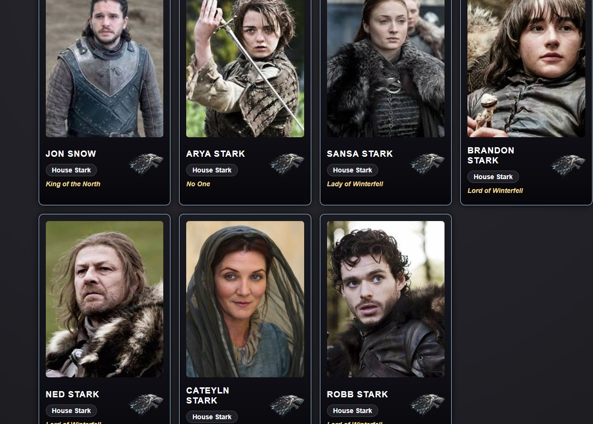
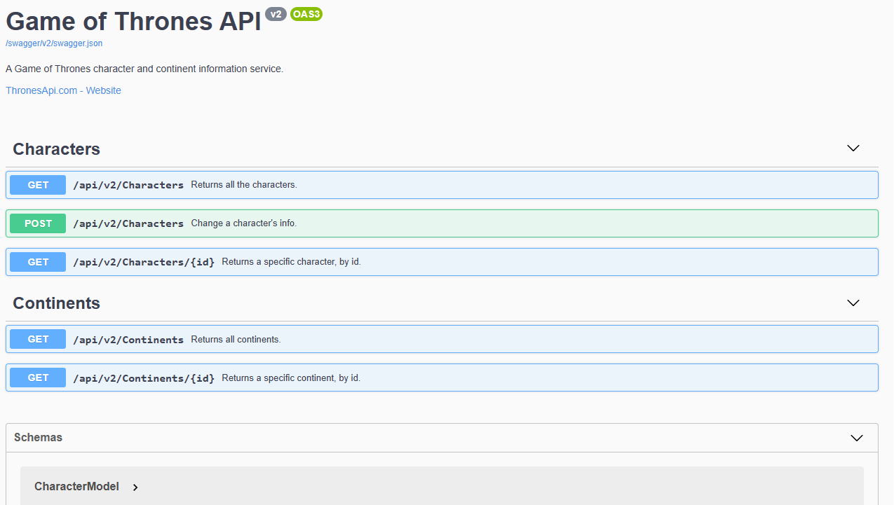

# 🐉 Game of Thrones API Project
Proyecto académico desarrollado por el Equipo 3 en el marco de la formación de JM Factoria, cuyo objetivo es el consumo y visualización de datos desde una API REST utilizando HTML, CSS y JavaScript.

La aplicación muestra los personajes del universo Game of Thrones, así como sus principales características, respetando una estética coherente con la ambientación de la serie.

## 📋 Índice
📖 Descripción del proyecto

🛠 Tecnologías utilizadas

🌐 API utilizada

⚙️ Funcionalidades

🚀 Instalación y ejecución

🔄 Flujo de trabajo en Git

👥 Equipo de desarrollo

⚖️ Consideraciones legales

## 📖 Descripción del proyecto
Este proyecto consiste en una aplicación web que consume datos de la Thrones API para mostrar información detallada sobre los personajes del universo de Game of Thrones.

Se ha desarrollado siguiendo principios de Clean Code, una correcta organización por carpetas y control de versiones con Git, trabajando en equipo mediante ramas independientes y una rama dev como punto de integración.

## 🛠 Tecnologías utilizadas
HTML5 — Estructura semántica del sitio

CSS3 — Estilos y maquetación (Flexbox / Grid)

JavaScript (ES6) — Consumo de la API y manipulación del DOM

JSON — Formato de intercambio de datos

Git & GitHub — Control de versiones y trabajo colaborativo

Live Server — Entorno de desarrollo local

## 🌐 API utilizada
Thrones API
🔗 https://thronesapi.com/

Endpoint principal
/v2/Characters

## ⚙️ Funcionalidades
Obtención de datos desde una API REST

Renderizado dinámico de personajes

-Visualización de:

 -Nombre completo

 -Casa

 -Título

 -Imagen

-Información adicional proporcionada por la API

 -Diseño visual acorde al universo Game of Thrones

 -Estructura semántica con:

   --header

   --main

   --footer

   

## 📁 Estructura del proyecto

GameOfthrones.Api.G3/
│
├── index.html
├── README.md
│
├── styles/
│   └── index.css
│
├── js/
│   └── index.js
│
└── assets/
    └── images/
La estructura del proyecto está diseñada para facilitar la escalabilidad, el mantenimiento del código y el trabajo colaborativo en equipo.

## 🚀 Instalación y ejecución

1️⃣ Clonar el repositorio:

bash
git clone https://github.com/Adrian-1986/GameOfthrones.Api.G3.git
2️⃣ Acceder al directorio del proyecto:

bash
cd GameOfthrones.Api.G3
3️⃣ Ejecutar la aplicación:

Abrir el archivo index.html utilizando Live Server

O abrir directamente el archivo en el navegador web

⚠️ No se requieren dependencias adicionales para su ejecución.

## 🔄 Flujo de trabajo en Git
Para el desarrollo de este proyecto se ha reutilizado la estructura base y algunos patrones de un proyecto anterior ("El Mundo de Tinta"), adaptándolos al nuevo dominio y a los requisitos específicos de la Thrones API.

Elementos mantenidos:

-Organización modular de carpetas

-Patrón de consumo de API mediante fetch

-Creación dinámica de tarjetas de contenido con JavaScript

Elementos adaptados:

-Nombres de variables y funciones

-Campos y estructura del JSON recibido desde la API

-Estética visual ajustada al universo de Game of Thrones

Estrategia de ramas:

 -main → rama estable

 -dev → rama de integración

 -feature/* y fix/* → ramas de desarrollo individual

Proceso de trabajo habitual:

-Creación de una rama desde dev

-Desarrollo de la funcionalidad asignada

-Integración de cambios en dev

-Resolución de conflictos si fuese necesario

## 👥 Equipo de desarrollo
Equipo 3 – JM Factoria

Proyecto realizado de forma colaborativa, fomentando:

Buenas prácticas de desarrollo

Comunicación efectiva en equipo

Control de versiones con Git

Integración continua de funcionalidades

## ⚖️ Consideraciones legales
Este proyecto se ha desarrollado exclusivamente con fines educativos.

Game of Thrones, sus personajes, imágenes y nombres son propiedad de HBO® y George R. R. Martin. El equipo no reclama ningún derecho sobre el contenido original.
